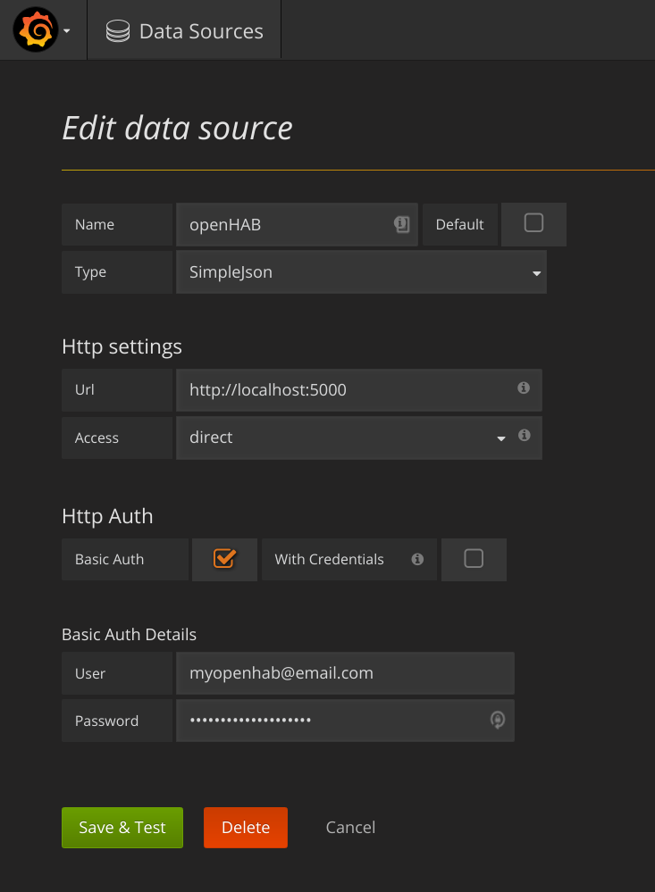
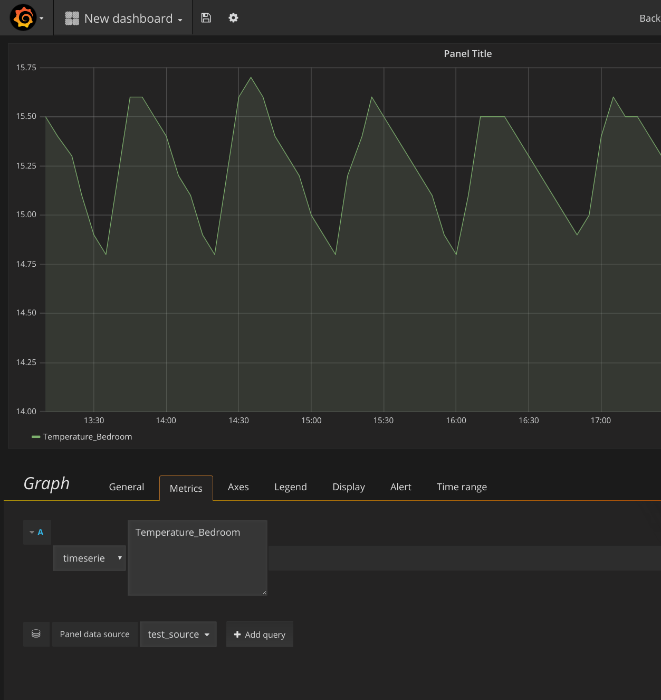

# Grafana OpenHAB Persistence Data Source

## Introduction

This is simple flask server proof-of-concept implementation of  [Grafana Simple JSON Data Source API](https://github.com/grafana/simple-json-datasource),proxying requests to openHAB persistence REST API.

```text
Grafana (Simple JSON Data Source) <-> flask <-> openHAB REST API
```

## Requirements

Setup assumes linux system with docker. Tested only with fedora linux.

## Usage

Start grafana and flask:
```bash
make start_grafana
make start_flask
```

You can access Grafana at `http://127.0.0.1:3000`. Use `admin:admin` to login.

Follow these configuration steps:

### 1. Add new Data Source 

Use HTTP Basic authentication with your myopenhab.org credentials.



### 2. Add `timeserie` chart

You can now use `timeserie` type targets in charts: 

## Missing features / TODO

- test :)
- support for various item types
- Grafana table format
- proper server
- any form of caching
- proper error handling
- ...

## License

MIT